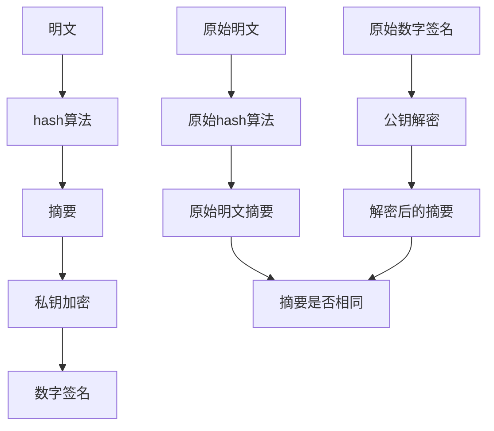

# 基本概念
证书持有人都有一对公钥和私钥，这两把密钥可以互为加解密

数字证书就是经过CA认证过的公钥，因此数字证书和公钥一样是公开的

# 公私钥签名和验签



# 探测支持的算法
```
openssl s_client -tls1_2 -cipher AES128-SHA -connect 127.0.0.1:21768
openssl s_client -tls1_2 -cipher AES256-SHA -connect 127.0.0.1:21768
openssl s_client -tls1_2 -cipher ECDHE-RSA-AES128-SHA -connect 127.0.0.1:21768
openssl s_client -tls1_2 -cipher ECDHE-RSA-AES128-SHA256 -connect 127.0.0.1:21768
openssl s_client -tls1_2 -cipher ECDHE-RSA-AES256-SHA -connect 127.0.0.1:21768
nmap --script ssl-cert,ssl-enum-ciphers -p 21768,31768,12333,13333 127.0.0.1
nmap --script ssl-cert,ssl-enum-ciphers -p 31768,21768 127.0.0.1
```

# 生成公私钥对
生成公私钥对
```
openssl genpkey -algorithm RSA -out private_key.pem
openssl rsa -in private_key.pem -pubout -out public_key.pem

生成1024为RSA公私钥对
openssl genpkey -algorithm RSA -out private_key.pem -pkeyopt rsa_keygen_bits:1024
openssl rsa -in private_key.pem -pubout -out public_key.pem

查看上述公私钥信息
openssl pkey -in private_key.pem -text
openssl rsa -in public_key.pem -pubin -text -noout

查看公钥的秘钥长度
openssl rsa -pubin -inform PEM -text -noout -in public_key.pem
```

